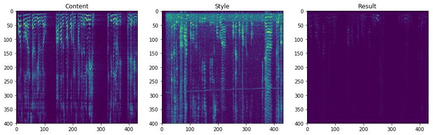

# Audio Style Transfer

This is a brief implementation of style transfer from a style waveform into a content waveform.

### Architecture overview
1. First we concert the audio to a spectrogram via Short Time Fourier Transform (2D representation of a 1D signal; 1xT image with F channels).
2. Next, the network we use has only one layer with 4096 filters.
3. Finally we need to reconstruct a signal from its spectrogram, thus doing the inversion with Griffin-Lim algorithm.

### Rationale and Results
We used style transfer rather than text to speech as we wanted to test the reproducibility of a person’s voice immediately without having to record the target’s voice with preset/fixed text (i.e. TTS requires training text embeddings with each phoneme sound). Style transfer makes more sense in the real world, as any agent intending to mimic one’s voice would need a dual architecture of first generating a generic voice from desired text, then performing a style transfer to convert the generic voice into the stylized/target voice. 

We found that when two extremely contrasting audio samples were used in style transfer, the degree of style transfer was higher, such as in the case of mixing rap music with opera music. 

However, we found that when mixing low variance audio (e.g. the voice of the professor of ISOM4200 giving lecture), the content and style audio have low contrast and insufficient waveform concatenation could occur. 

### Takeaways
1. High quality speech synthesis at present cannot work without large dataset of labelled text and speech of target
2. Although style transfer is quick, it cannot learn phoneme or tonal changes and adapt them to different time positions; this also means if a black hat records sufficient tonal changes from target, they could: Step 1 - Build a generic TTS voice; then Step 2 - Apply the phoneme-sufficient voice set to fit the text
